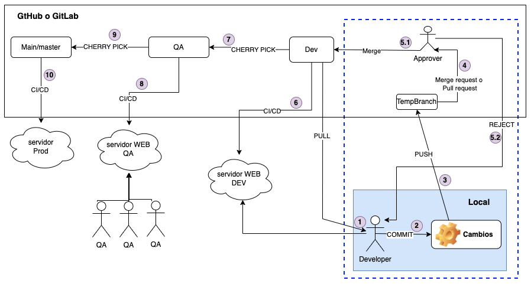

# Git Flow and Branching Strategy

## Git Commands
* ### Clone a remote repository in a local computer
    ``git clone <repository_url>``

    Example:

        git clone https://github.com/ever-utn-devops/git-branching.git

* ### Initialize a New Repository
    This command initializes a new Git repository in the specified directory. If run in an existing project directory, it creates a Git repository in that directory.
    
    ``git init``

* ### Checking the current branch
    ``git branch``

    Example:

        git branch

* ### Creating a new branch
    ``git branch -M <branch_name>``

    Example:

        git branch -M test

* ### Switching to another branch
    ``git checkout <branch_name>``

    Example:

        git checkout test

* ### Creating and switching to a new branch
    ``git checkout -b <branch_name>``

    Example:

        git checkout -b test2

* ### Add files to the repository
    Adding all changed files to the repository
    ``git add .``

    Example:
        
        git add .
    
    Adding only a file to the repository
    ``git add <file_name>``

    Example:
        
        git add server.js

* ### Commit changes
    Commit the staged changes to the repository with a message. The ``-m``flag allows you to specify a commit message directly.

    ``git commit -m "commit message" ``

    Example:
        
        git commit -m "new printing fuctionality"

* ### Push Changes to Github
    Pushing local commits to the remote repository. The ``-u`` flag sets the upstream branch.

    ``git push -u origin <branch_name> ``

    Examples:
        
        git push

        or 

        git push -u origin dev

* ### Merge changes to another branch
    Merge the specified branch into the current branch
   
    ``git remote add origin <repository_url> ``

    Examples:
        
        git remote add origin https://github.com/ever-utn-devops/git-branching.git

* ### Link to a remote repository
   
    ``git remote add origin <repository_url> ``

    Examples:
        
        git remote add origin https://github.com/ever-utn-devops/git-branching.git

* ### Checking status and history
    Shows the status of changes as untracked, modified or staged. It provides a snapshot of the current state.
   
    ``git status ``

* ### View Commit History
   
    ``git log ``

* ### Undoing changes
    Undo changes in the working repository
   
    ``git checkout -- <file_name> ``

    Examples:
        
        git checkout -- server.js

* ### Pull changes from a remote repository
    Fetches changes from a remote repository and merges them into the current branch.
 
    ``git pull origin <branch_name> ``

    Examples:
        
        git pull origin main

* ### Stash changes from a remote repository
    It takes the uncommitted changes, save them away for later use, and then reverts them from your working copy
 
    ``git stash ``

* ### Re-apply or recover a stashed changes
    Recover all stashed changes and delete the stashes changes.
 
    ``git stash pop``

    Recover all stashed changes and keep them.
 
    ``git stash apply``

* ### Show all stashed changes
 
    ``git stash list``

* ### Soft reset from a remote repository
    Reset from remote branch getting historical changes and keeping the current local changes as unstashed and uncommitted.
 
    ``git reset --soft origin <branch_name>``

    Example:
        
        git reset --soft origin main

* ### Hard reset from a remote repository
    Reset from remote branch replacing the current local changes from historical and lastest changes.
 
    ``git reset --hard origin <branch_name>``

    Example:
        
        git reset --hard origin main