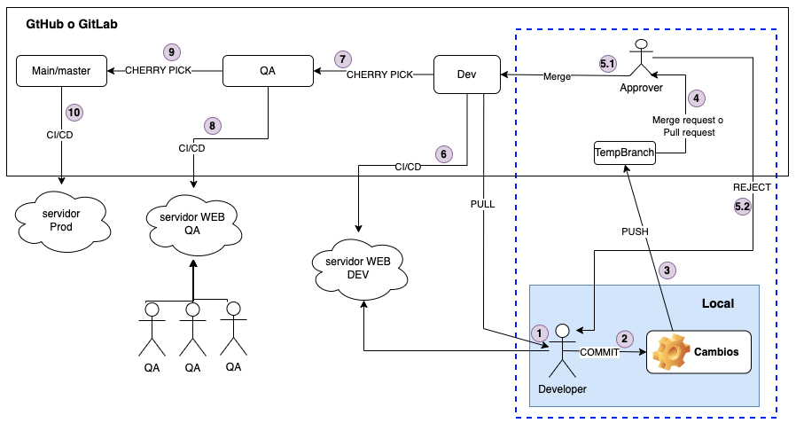

# Git Flow and Branching Strategy

## Git Commands
* ### Clone a remote repository in a local computer
    ``git clone <repository_url>``

    Example:

        git clone https://github.com/ever-utn-devops/git-branching.git

* ### Initialize a New Repository
    This command initializes a new Git repository in the specified directory. If run in an existing project directory, it creates a Git repository in that directory.
    
    ``git init``

* ### Checking the current branch
    ``git branch``

    Example:

        git branch

* ### Creating a new branch
    ``git branch -M <branch_name>``

    Example:

        git branch -M test

* ### Switching to another branch
    ``git checkout <branch_name>``

    Example:

        git checkout test

* ### Creating and switching to a new branch
    ``git checkout -b <branch_name>``

    Example:

        git checkout -b test2

* ### Add files to the repository
    Adding all changed files to the repository
    ``git add .``

    Example:
        
        git add .
    
    Adding only a file to the repository
    ``git add <file_name>``

    Example:
        
        git add server.js

* ### Commit changes
    Commit the staged changes to the repository with a message. The ``-m``flag allows you to specify a commit message directly.

    ``git commit -m "commit message" ``

    Example:
        
        git commit -m "new printing fuctionality"

* ### Push Changes to Github
    Pushing local commits to the remote repository. The ``-u`` flag sets the upstream branch.

    ``git push -u origin <branch_name> ``

    Examples:
        
        git push

        or 

        git push -u origin dev

* ### Merge changes to another branch
    Merge the specified branch into the current branch
   
    ``git remote add origin <repository_url> ``

    Examples:
        
        git remote add origin https://github.com/ever-utn-devops/git-branching.git

* ### Link to a remote repository
   
    ``git remote add origin <repository_url> ``

    Examples:
        
        git remote add origin https://github.com/ever-utn-devops/git-branching.git

* ### Checking status and history
    Shows the status of changes as untracked, modified or staged. It provides a snapshot of the current state.
   
    ``git status ``

* ### View Commit History
   
    ``git log ``

* ### Undoing changes
    Undo changes in the working repository
   
    ``git checkout -- <file_name> ``

    Examples:
        
        git checkout -- server.js

* ### Pull changes from a remote repository
    Fetches changes from a remote repository and merges them into the current branch.
 
    ``git pull origin <branch_name> ``

    Examples:
        
        git pull origin main

* ### Stash changes from a remote repository
    It takes the uncommitted changes, save them away for later use, and then reverts them from your working copy
 
    ``git stash ``

* ### Re-apply or recover a stashed changes
    Recover all stashed changes and delete the stashes changes.
 
    ``git stash pop``

    Recover all stashed changes and keep them.
 
    ``git stash apply``

* ### Show all stashed changes
 
    ``git stash list``

* ### Soft reset from a remote repository
    Reseting from remote branch getting historical changes and keeping the current local changes as unstashed and uncommitted.
 
    ``git reset --soft origin <branch_name>``

    Example:
        
        git reset --soft origin main

* ### Hard reset from a remote repository
    Reseting from remote branch replacing the current local changes from historical and lastest changes.
 
    ``git reset --hard origin/<branch_name>``

    Example:
        
        git reset --hard origin/main

* ### Cherry-pick command to move commit to another branch
    It is used when moving specific commit to another branch.
 
    ``git cherry-pick <commit_sha>``

    Example:
        
        git cherry-pick 0bca21a299df35074e7599cba37346b028717ba1

* ### Cherry-pick abort
    Aborting a cherry-pick.
 
    ``git cherry-pick --abort``

* ### Cherry-pick continue
    Can be used to continue after resolving conflicts in a failed cherry-pick or revert.
 
    ``git cherry-pick --continue``

* ### Cherry-pick quit
    Can be used to continue after resolving conflicts in a failed cherry-pick or revert.
 
    ``git cherry-pick --continue``

* ### Cherry-pick skip
    Skip the current commit and continue with the rest of the sequence..
 
    ``git cherry-pick --skip``

    More information about [Cherry-pick](https://git-scm.com/docs/git-cherry-pick)

 

# Workshop planning
## Jan 13th 2024
- Explaining about Versioning Control functionality.
- Explaining about best practices in branching strategy as part of the Software Development Life Cycle (SDLC).
- Explaining how to apply Continuous Integration (CI) and its best practices in Github.
- Create security rules into branches.
- Starting practical scenarios with git commands
 
    - Cloning and initiating a repository.
    - Creating and moving between branches, and recovering temporal changes.
    - Commiting and pushing changes to Github

### Instructions of practical scenario
- Clone this repository in your computer.
- Pull the latest version of main branch.
- Create a new feature branch with your name but using a prefix 'f' Example: f-ever
- Be sure you are in your new feature branch.
- Copy the following code and paste it into [/routes/roomsroutes.js](/routes/roomsroutes.js)
    app.route('/rooms/booking')
            .put(rooms.booking)
        
        app.route('/rooms/unbooking')
            .put(rooms.unbooking)
            // .post(rooms.create_a_room)
            // .put(rooms.update_a_room);

            // app.route('/rooms/updateall')
            // .put(rooms.update_rooms);

        app.route('/rooms/:roomName')
            .get(rooms.read_a_room)
            //  .delete(rooms.delete_a_room);

        //app.route('/api/auth/:username/:password')
        app.route('/users/auth')
            .post(auth.authUser);
        
        app.route('/users')
            .get(auth.getUsers);
        };

- Copy the following code and paste it into [/controllers/RoomController.js](/controllers/RoomController.js)

        exports.read_a_room = function(req, res) {
            let httpCode=0;
            let result= {};
            
            if (req.params.roomName === undefined || req.params.roomName === null){
                httpCode=httpresponse.BAD_REQUEST
                result = {
                    data: null,
                    responseCode: endpointresponse.MISSING_PARAMETERS,
                    message: 'You must send the room as parameter.'
                };
            }else{
                let room = model.getById(req.params.roomName );
                if (room.length > 0){
                    httpCode=httpresponse.OK
                    result = {
                        data: room[0],
                        responseCode: endpointresponse.INFO_FOUND,
                        message: sucess_meg
                    };
                }else{
                    httpCode=httpresponse.BAD_REQUEST
                    result = {
                        data: null,
                        responseCode: endpointresponse.INFO_NOT_FOUND,
                        message: 'Room not found.'
                    };
                }
            }
            
            res.status(httpCode).send(result);
        };

        exports.booking = function(req, res){
            let httpCode=0;
            let result= {};
            if (req.body.username === undefined || req.body.room === undefined || req.body === null || req.body.length === 0 || req.body === ''){
                httpCode=httpresponse.BAD_REQUEST
                result = {
                    data: null,
                    responseCode: endpointresponse.MISSING_PARAMETERS,
                    message: 'Must provide the room and the username to book a room.'
                };
            }else{
                let room = model.getById(req.body.room);
                if (room.length > 0){
                    if (!room[0]['is_busy']){
                        let currentDate = new Date();
                        let formattedDate = `${currentDate.getFullYear()}-${currentDate.getMonth() + 1}-${currentDate.getDate()}`;    
                        let roomupdated = model.update(req.body.room, true, req.body.username, formattedDate)
                        if (roomupdated == null){
                            
                        }else{
                            httpCode=httpresponse.OK
                            result = {
                                data: roomupdated,
                                responseCode: endpointresponse.SUCESSFUL,
                                message: sucess_meg
                            };
                        }
                    }else{
                        httpCode=httpresponse.BAD_REQUEST
                        result = {
                            data: null,
                            responseCode: endpointresponse.INFO_NOT_FOUND,
                            message: 'The room cannot be booked, it has been booked previously.'
                        };
                    }            
                }else{
                    httpCode=httpresponse.BAD_REQUEST
                    result = {
                        data: null,
                        responseCode: endpointresponse.INFO_NOT_FOUND,
                        message: 'Room not found.'
                    };
                }
            }
            res.status(httpCode).send(result);
        };

        exports.unbooking = function(req, res){
            let httpCode=0;
            let result= {};
            if (req.body.room === undefined || req.body === null || req.body.length === 0 || req.body === ''){
                httpCode=httpresponse.BAD_REQUEST
                result = {
                    data: null,
                    responseCode: endpointresponse.MISSING_PARAMETERS,
                    message: 'Must provide the room to cancel the booking.'
                };
            }else{
                let room = model.update(req.body.room, false, '', null)
                if (room == null){
                    httpCode=httpresponse.BAD_REQUEST
                    result = {
                        data: null,
                        responseCode: endpointresponse.INFO_NOT_FOUND,
                        message: 'Room not found.'
                    };
                }else{
                    httpCode=httpresponse.OK
                    result = {
                        data: room,
                        responseCode: endpointresponse.SUCESSFUL,
                        message: sucess_meg
                    };
                }
                
            }
            res.status(httpCode).send(result);
        };
- Commit and push the changes into your origin feature branch.
- Go to Gihub webpage and verify the changes have been uploaded.

## Jan 14th 2024
- Refresh about Git Flow and git commands.
- Best practices to manage and fix changes conflict when commiting and pushing new changes.
- Merging changes from feature branch to dev/qa branches through Pull Request (PR) and Cherry-pick.
 
    - Create new changes.
    - Fix conflicts, commit and push changes.
    - Code review and merging changes to dev branch through Pull Request.
    - Move a specific commit to QA branch.

    Cambio por Ever Barahona